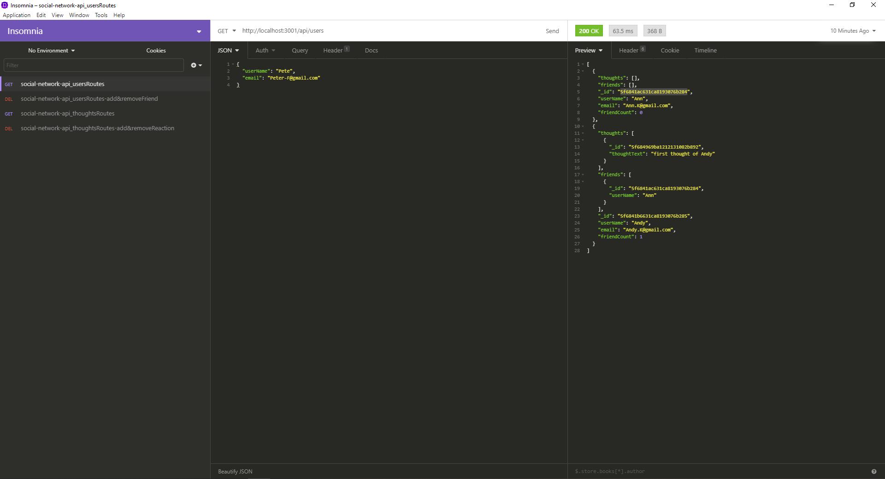

# Social Network Api

## Description

This API is for a social network web application where users can share their thoughts, react to friends’ thoughts, and create a friend list.

## Table of Contents

- [Contribution](#contribution)
- [Screenshot](#screenshot)
- [License](#license)
- [Badges](#badges)
- [GitHub](#github)
- [Heroku](#heroku)

## Screenshot

## Contribution

Made with ❤️ by Ruohan Wang

## License

MIT

## Badges

## GitHub

My GitHub link: ( https://github.com/rhw-git/Social-Network-API)
